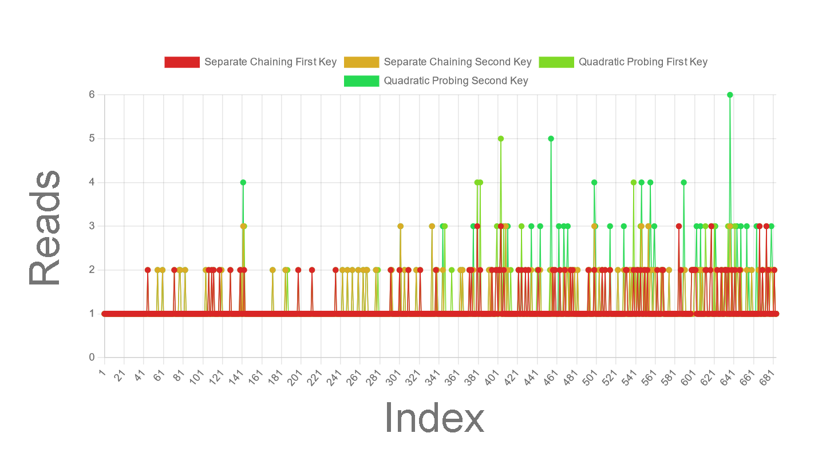

# CS2240 Project 5 - Aaron Luciano
**Hashing Dataset** 
*11/6/2023*

* **Information about your data set** 
  * The data was all accumulated from my own personal playlists on spotify. They were not all one large playlist,
    but rather I had to convert the multiple CSV files into one general CSV file called "merged-playlists.csv"
    through the use of windows' built in terminal. To acquire all the CSV files, I used https://exportify.net,
    more information on the website. *Note*: The data I decided to hash for this project, I hashed Track Names
    and Artists only. 
     

* **Graphs for the number of reads for all 20 hash tables** 
  * Hashing Line Graph:
    
    * This line graph represents the number of reads required for each insertion operation 
      in different hash tables, as indicated by the varying colors for separate chaining 
      and quadratic probing methods. The x-axis labeled "Index" corresponds to individual 
      insertion operations, while the y-axis labeled "Reads" quantifies how many items were 
      read during each insertion. The distinct spikes, particularly in the green series, 
      suggest higher read counts at specific indices, which indicates various collision activity,
      such as probing in open addressing or traversing linked lists in separate chaining.  
* **Read Counts Analysis** 
  * Table Size on Collision:
    * We see with a larger hash table size, it typically results in fewer collisions because 
    there are more slots available for the hashing algorithm to distribute the keys. 
    * When the graph shows lower read counts for larger tables, it suggests that increasing the 
    table size has effectively reduced the number of collisions.
  * Distribution:
    * The efficiency of the keys, determined by the hashing function, impacts read counts. 
    * If the keys are _well-distributed_, then the smaller tables show more reasonable read counts. 
    * Conversely, _poorly distributed_ keys lead to higher read counts due to increased collisions, 
    especially in smaller tables.
    * It appears that Quadratic Probing exhibits more variation in read counts than Separate Chaining.
    This could be due to the inherent nature of open addressing, where clustering can lead to longer 
    probing sequences.
  * Collision Resolution: 
    * Separate Chaining (red and yellow lines) tends to have consistent read counts because 
    collisions are handled by adding to a bucket's linked list, with the read count largely 
    unaffected by table size. 
    * In contrast, Quadratic Probing (green and light green lines) show varying read counts 
    across different table sizes due to the nature of open addressing collision resolution, 
    which is more sensitive to the load factor of the table.  
* **Which GetKey Performed Best** 
  * For this data-set, both the Separate Chaining first and second getKey performed similarly,
  and thus, the "best" overall.
  * We see with the Quadratic Probing getKeys on the chart, that they had much more
  variability than compared to the Separate Chaining keys, so we can conclusively state that 
  both the first and second getKey for Quadratic Probing did not perform the best.
  * Again, both Separate Chaining's first and second getKey performed very smilarly, however when
  analyzing the graph, we can see that Separate Chaining's first getKey actually had fewer outliers
  than the second getKey, meaning that it performed better as it had fewer collisions and required
  less additional reads.
  * I feel it's also important to mention how consistently well both instances of Separate Chaining
  performed on this data-set as a whole; they maintained a _very_ low read count and were able to
  hash the data-set quite quickly. 
    * _Note: When I refer to Quadratic Probing, it can also be read as open addressing, as Quadratic
    Probing is a form of open addressing; I just decided to say Quadratic Probing as it's the only
    form of open addressing I used._
* **Conclusions** 
  * It is apparent that separate chaining is the superior collision resolution method for the 
  given dataset. It consistently showed lower read counts across insertions, suggesting a more 
  efficient distribution of keys and collision management. In contrast, quadratic probing 
  displayed a much higher degree of variability, with pronounced spikes that imply more 
  frequent and severe collision occurrences. The stability of separate chaining, with its use of 
  linked lists at each index, likely contributes to its robust performance against increasing 
  load factors, where it maintains low read counts despite more elements being added. 
  * Overall, the visual data suggests that separate chaining handles the specific characteristics 
  and collision patterns of this dataset much better than open addressing, resulting in a more 
  reliable and performant hashing process.